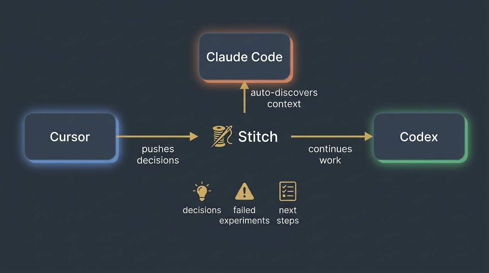
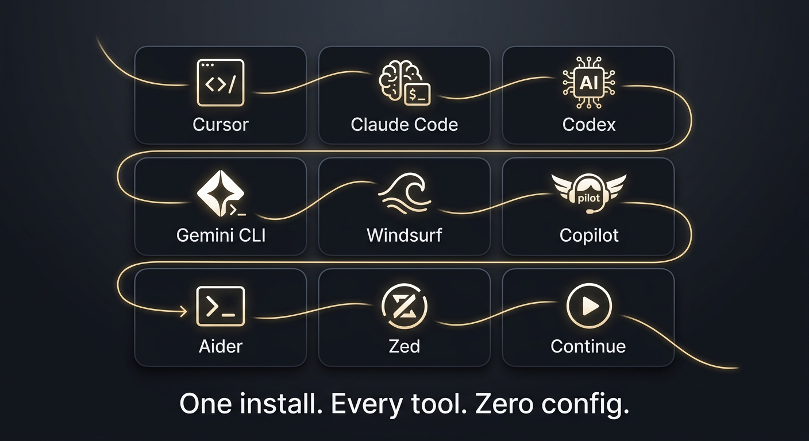

<p align="center">
  
</p>

<p align="center">
  <strong>Cross-tool memory for AI agents. Never re-explain your work.</strong>
</p>

<p align="center">
  
  
  
  
  
</p>

---

## The Problem

You're deep in a task in Cursor. You hit the token limit. You open Claude Code to continue.

**The new agent has zero memory.**

It doesn't know you tried approach X and it failed. It doesn't know you chose library Y for a reason. It wastes 15 minutes rediscovering what took you 45 minutes to figure out.

This happens constantly:

- **Tool switching kills context** — switch from Cursor to Claude Code to Codex, and each agent starts blind
- **Context summarization loses nuance** — auto-summaries drop the failed experiments, rejected alternatives, and "don't try this" warnings
- **Session crash = square one** — terminal closes, laptop restarts, and the agent has to re-read every file, re-check every diff
- **Repeating the same mistakes** — Agent B tries the same approach Agent A already spent 45 minutes discovering doesn't work
- **Token-expensive rediscovery** — every new session burns tokens re-reading files, re-checking diffs, and re-building understanding that already existed
- **No git, no memory** — existing tools only capture context on commits, but most AI work happens *between* commits while exploring and debugging

<p align="center">
  
</p>

<p align="center">
  
</p>

## The Solution

**Stitch** is a lightweight Python layer that acts as shared memory across all your AI tools.

```
Agent A works → pushes decisions & snapshots → you switch tools →
Agent B auto-discovers context → continues exactly where A left off
```

<p align="center">
  
</p>

<p align="center">
  
</p>

Three things make it different:

1. **Preserves only what matters** — decisions, failed experiments, warnings, and next steps. Not raw chat history. Saves tokens.
2. **Works from any directory** — say "resume the database migration" and Stitch finds the right task via BM25 relevance matching, no matter which folder you're in.
3. **Fully automatic** — agents discover Stitch on their own via MCP or injected instructions. No copy-pasting context. No "here's what we did before" preambles.

---

## Quick Start

```bash
pip install xstitch
stitch global-setup
```

That's it. Every AI tool on your machine is now Stitch-aware.

```bash
# Per-project initialization (once per project)
cd /your/project
stitch auto-setup
```

> Alternatively, install from source: `pip install -e .` in this repo.

---

## Supported Tools

<p align="center">
  
</p>

| Tool | Integration Method |
|------|-------------------|
| **Cursor** | MCP server + `.cursor/rules/` enforcement |
| **Claude Code** | MCP server + deterministic hooks |
| **Codex** | MCP server (NDJSON) + `AGENTS.md` |
| **Gemini CLI** | MCP server + `GEMINI.md` |
| **Windsurf** | MCP server |
| **Copilot CLI** | MCP server |
| **Zed** | MCP server |
| **Continue.dev** | MCP server |
| **Aider** | `CONVENTIONS.md` read directive |

Don't see your tool? Stitch generates `~/.stitch/AGENT_BOOTSTRAP.md` — a universal fallback that works with any agent that can run shell commands. And the [plugin system](docs/adding-tools.md) makes adding new tools straightforward.

---

## Key Features

| Feature | What it does |
|---------|-------------|
| **Zero dependencies** | Pure Python stdlib. No numpy, no torch, no nothing. |
| **MCP + instruction files** | Dual integration: native MCP tools for capable agents, injected markdown for everything else. |
| **BM25 relevance search** | Say "resume the auth refactor" — Stitch finds it even if those words don't appear in the title. Includes trigram fuzzy matching for typo tolerance. |
| **Resume briefings** | New agents get structured context: decisions with reasoning, failed experiments with warnings, exact next steps, and live repo state. |
| **Self-healing diagnostics** | `stitch doctor` detects broken installs, corrupted state, missing config. Suggests exact fix commands. |
| **Plugin system** | Add new tools via `pyproject.toml` entry points — no core code changes needed. |
| **Optional semantic search** | `pip install xstitch[search]` adds sentence-transformer embeddings for meaning-based task matching. |
| **TTL cleanup** | Old task data (>45 days) is automatically pruned to save disk space. |
| **Auto-detection** | `stitch global-setup` finds every AI tool on your machine and configures them all. |

---

## How It Works

```
┌─────────────┐     ┌─────────────┐     ┌─────────────┐
│   Cursor     │     │ Claude Code │     │   Codex     │
│  (Agent A)   │     │  (Agent B)  │     │  (Agent C)  │
└──────┬───────┘     └──────┬──────┘     └──────┬──────┘
       │                    │                    │
       │  push decisions    │  auto-discover     │  auto-discover
       │  push snapshots    │  resume briefing   │  resume briefing
       │                    │                    │
       ▼                    ▼                    ▼
┌──────────────────────────────────────────────────────┐
│                    Stitch Layer                       │
│                                                      │
│  ┌──────────┐  ┌──────────┐  ┌──────────────────┐   │
│  │ Task     │  │ BM25     │  │ Resume Briefing  │   │
│  │ Store    │  │ Search   │  │ Generator        │   │
│  └──────────┘  └──────────┘  └──────────────────┘   │
│                                                      │
│  Decisions · Snapshots · Warnings · Next Steps       │
└──────────────────────────────────────────────────────┘
```

1. **Agent A** works on a task — pushes decisions, snapshots, and checkpoints to Stitch
2. You hit the token limit (or switch tools for any reason)
3. **Agent B** opens — automatically discovers Stitch via MCP or instructions
4. Stitch generates a **resume briefing** with the full decision history, warnings about dead ends, and exact next steps
5. Agent B continues from where A left off — no wasted tokens, no repeated mistakes

Task data lives at `~/.stitch/projects/` (outside your repo, keeps it clean). Instruction files live inside the repo for agents to read.

> For the full architecture, see [docs/architecture.md](docs/architecture.md).

---

## Use Cases

**Hit the token limit?** Switch from Cursor to Claude Code. The new agent picks up your exact state — decisions, rejected approaches, warnings about dead ends. No "here's what we did before" preambles.

**Laptop restart or session crash?** Your terminal closes, laptop restarts, or the IDE crashes mid-task. Without Stitch, the agent has to re-read every file, re-check every diff, re-piece together what state you're in. With Stitch, it resumes in seconds.

**Context summarization lost the details?** When long chats get auto-summarized, the nuances vanish — the failed experiments, the rejected alternatives, the "don't try this" warnings. Stitch preserves these explicitly as structured data that survives any summarization.

**Cross-directory work?** Say "resume the auth refactor" from any project directory. Stitch finds the right task via BM25 relevance matching — even if those exact words never appear in the title.

**Failed experiments?** The next agent gets explicit warnings: "Don't try approach X — it fails because of Y. Use Z instead." No more wasting 45 minutes rediscovering what you already figured out.

**Not dependent on git.** Unlike tools that only capture context on commits, Stitch captures decisions and state *while you work* — whether you're mid-experiment, debugging, or exploring approaches. You don't have to commit to save your context.

**Multiple tools on the same task.** Start in Cursor for quick edits, switch to Claude Code for complex refactoring, use Codex for a second opinion, finish in Gemini CLI. Each agent continues seamlessly from where the previous one left off.

**Not just for developers.** PMs writing specs, designers iterating on components, EMs tracking architecture decisions — anyone using AI tools benefits. If you switch tools or sessions, Stitch preserves your context.

<p align="center">
  
</p>

**4-tool demo, zero context loss.** We built a TODO app by handing off across Codex, Antigravity (Gemini), Cursor, and Claude Code — each agent picked up exactly where the last left off, automatically. No manual intervention.

<p align="center">
  
</p>

---

## vs. Other Tools

| | Stitch | [cass](https://github.com/Dicklesworthstone/coding_agent_session_search) | [Acontext](https://github.com/memodb-io/Acontext) | [AgentSwap](https://github.com/nimishgj/agentswap) | [agent-handoff](https://pypi.org/project/agent-handoff/) |
|---|---|---|---|---|---|
| **Purpose** | Active context transfer | Read-only session search | Record agent actions | Translate chat formats | Manual file handoff |
| **Cross-tool** | 9 tools, auto-configured | 11 readers (read-only) | Framework-level | 3 tools | Manual |
| **What's preserved** | Decisions, failures, warnings | Raw chat history | What agent did | Full chat | 3 markdown files |
| **Discovery** | Automatic (MCP + instructions) | CLI search | Markdown files | CLI conversion | Manual |
| **Intelligence** | BM25 relevance matching | BM25 + semantic search | None | None | None |
| **Dependencies** | Zero | Rust + ONNX | Python | Python | Python |

**Stitch is the only tool that actively transfers meaningful context between agents.** Others search, record, or translate — Stitch ensures the next agent knows *why* decisions were made and *what not to try*.

---

## CLI Reference

```bash
stitch auto-setup              # Initialize Stitch in current project
stitch auto "<prompt>"         # Intelligent routing: detect intent, find/create task
stitch global-setup            # Configure all AI tools on your machine

stitch snap -m "message"       # Capture a snapshot
stitch decide -p "problem" -c "chosen" -a "alternatives" -r "reasoning"
stitch checkpoint -s "summary" # Rich pre-summarization checkpoint

stitch task new "title"        # Create a task
stitch task list               # List all tasks
stitch task show               # Show current task details

stitch search "query"          # Search tasks by keyword
stitch smart-match "query"     # BM25 relevance search across tasks
stitch resume                  # Generate structured resume briefing
stitch handoff                 # Generate handoff bundle
stitch doctor                  # Diagnose installation health
```

> Full CLI documentation: [docs/cli-reference.md](docs/cli-reference.md)

---

## Documentation

- [Architecture](docs/architecture.md) — system design, module structure, design decisions
- [Search Engine Design](docs/search-design.md) — BM25, fuzzy matching, embeddings, score fusion
- [Adding New Tools](docs/adding-tools.md) — plugin system, entry points, integration guide
- [Contributing](CONTRIBUTING.md) — development workflow, code style, testing

---

## Contributing

We welcome contributions. See [CONTRIBUTING.md](CONTRIBUTING.md) for details.

```bash
git clone https://github.com/raghavvbiyani/xstitch.git && cd xstitch
pip install -e ".[all]"
python -m pytest tests/ -v
```

---

## License

MIT License. See [LICENSE](LICENSE) for details.

Created by [Raghav Biyani](https://github.com/raghavvbiyani).

---

<p align="center">
  <strong>Stop losing context. Start stitching.</strong>
</p>
